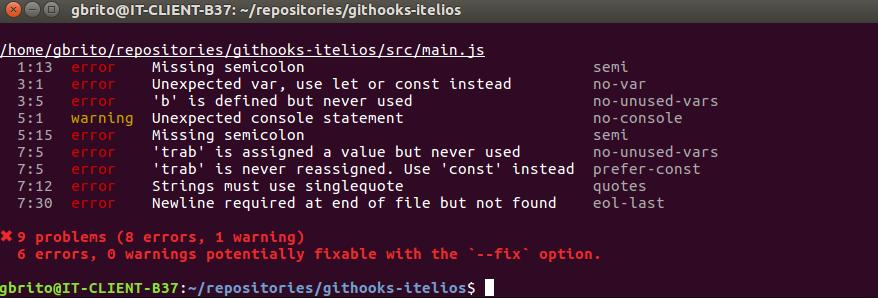
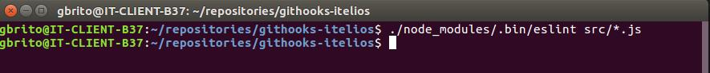
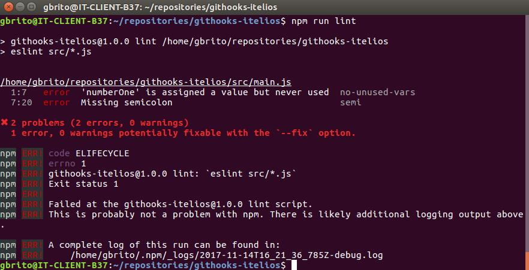

# Melhorando seu workflow com NPM Scripts, ESlint e Git Hooks!

>Não Importa se você trabalha sozinho, em um time ou se só coda por hobbie. Escrever um código padronizado e limpo é sua obrigação!

<p align="center">
  
</p>

## TL;DR
O Git Husky é uma ferramenta que vai dar um boost no seu workflow, testar seu código, seu styleguide e ai sim, se estiver tudo certo, vai subir seu código para a produção.

<p align="center">
  
</p>

Antes de explicar como a ferramenta funciona, vou falar sobre alguns pontos positivos e negativos sobre a padronização do seu código.

#### Pontos positivos:

* Um código com melhor legibilidade;

* Facilidade de manutenção;

* Código escalável;

* Menos bugs;

* Redução do tempo (e custo) do projeto;

* Um chefe feliz;

* E menos dor de cabeça.


#### Pontos negativos:

SE, numa sexta-feira, você não seguiu o padrão de código proposto pelo projeto, eis o ponto negativo:

* Sem HappyHour pra você :)

SENÃO não existem pontos negativos!

<p align="center">
  
  <p align="center">"Caralho, o maluco é brabo" - Stronda, Leo.</figcaption>
</p>

## Chega de enrolação e vamos ao ponto!

Irei exemplificar essa melhoria no seu workflow com o as seguintes ferramentas:

* [ESLint](https://eslint.org/)

>ESLint é um linter de código JavaScript, um projeto Open Source feito originalmente pelo Nicholas C. Zakas em 2013. A função do linter de código é analisar e detectar problemas no seu padrão de código e também verificar se o mesmo se encontra nos padrões de sua styleguide.

* [GitHusky](https://github.com/typicode/husky)

>O Git Husky nada mais é que um githook de forma facilitada. Um pouco mais recente, seu primeiro commit foi dia '23 Jun 2014' e foi criado por um usuário do github chamado Typicode.

## Parte 1 - definindo seu styleguide com ESLint

No diretório do seu projeto, inicie a instalação da ferramente ESLint com o commando:

```
  npm install eslint --save-dev
```

<p align="center">
  
</p>

Após a instalação, precisaremos definir o padrão do seu linter de código. Eu, particularmente, escolhi o styleguide do [AirBnB](https://github.com/airbnb/javascript). Iremos iniciar o padrão do seu styleguide com os seguintes passos:

```
  ./node_modules/.bin/eslint --init
```
<p align="center">
  
</p>

Com as setas, escolheremos então a opção 'Use a popular style guide' e apertaremos enter:

<p align="center">
  
</p>

E 'setaremos' o estilo do AirBnB:

<p align="center">
  
</p>

Nesse caso, não estarei usando o React, então eu respondo com 'N' a próxima etapa:

<p align="center">
  
</p>

E então será escolhido o formato do arquivo .eslintrc, que será gerado pelo linter. Eu sempre prefiro usar a extensão .json:

<p align="center">
  
</p>

Será instalado alguns plugins adicionais e pronto, seu linter está pronto para uso:

<p align="center">
  
</p>

## Parte 2 - Criando seu NPM Script

A parte anterior foi unicamente ensinando como aplicar o ESlint no seu projeto, agora iremos fazer um NPM Script que valide seu código! :)

Caso tenha dado uma olhada no [estilo de código do AirBnB](https://github.com/airbnb/javascript), você pode observar que o padrão deles não permite:

* Strings armazenadas com aspas duplas;

* Variáveis atribuidas sem serem chamadas;

* Variáveis declaradas com *var*

* A falta do ponto e virgula;

* etc.

### Criando um arquivo .js

Criei um arquivo JavaScript chamado **_main.js_** dentro de uma pasta chamada **_src_**, como vocês podem ver:

<p align="left">
  
</p>

E agora irei criar um código qualquer e rodar o ESlint pra verificar se há erros.

O código a ser validado será:

```javascript
const a = 12

var b;

console.log(a)

let trab = "asoijaiossaoasa";
```

<p align="left">
  
</p>

### Rodando o ESlint

Agora iremos efetuar o teste do ESlint, onde será verificado se o código segue o [padrão definido](ttps://github.com/airbnb/javascript).

A utilização é feita a partir do comando:

```
  ./node_modules/.bin/eslint src/*.js
```

<p align="center">
  
</p>

A verificação é feita dentro da pasta **_src_** com todos os arquivos com extensão **_.js_**.

O resultado é esse:

<p align="center">
  
</p>

Podemos ver que o ESlint detectou muitos erros de padrão, dentre eles:

* Falta de ponto e virgula;

* Variável atribuida com **_var_**;

* Que uma variável foi definida, mas nunca foi chamada.

* etc.

Está funcionando perfeitamente, então iremos arrumar o código e rodar novamente o script.
O código 'refatorado' agora será esse:

```javascript
const numberOne = 12;
const numberTwo = 2;

const trab = 'asoijaiossaoasa';

function sum(a, b) {
  const text = trab;

  return a + b + text.length();
}

sum(numberOne, numberTwo);

```

<p align="left">
  
</p>

Ao chamar o Script novamente, vemos que agora nenhum erro é disparado:

<p align="center">
  
</p>

<p align="center">
  
  <p align="center">Eita maravilha!</p>
</p>

Mas imagina que chato vai ser escrever _./node_modules/.bin/eslint src/*.js_ toda vez que for executar o linter.
É ai que entra o NPM Script com a automatização desse processo!

### Iniciando o seu NPM Script

Dentro do seu arquivo **_package.json_**, há uma sessão com o nome de 'scripts', é ali que iremos efetuar nossa configuração do script desejado.

<p align="center">
  
</p>

Dentro dessa sessão, iremos adicionar o seguinte trecho de código:

```
  "lint": "./node_modules/.bin/eslint src/*.js"
```
E ira ficar assim:

<p align="center">
  
</p>

Desse modo, é só ir no seu terminal e rodar o comando **_npm run lint_**

<p align="center">
  
</p>

Como nosso script está refatorado e pronto pra utilização, não será disparado nenhum erro!

<p align="center">
  
</p>

Caso tivesse dado algum erro, teria sido disparado igual ao erro anterior. Então fica muito mais fácil saber se o seu código está em dia com os padrões propostos!

<p align="center">
  
</p>